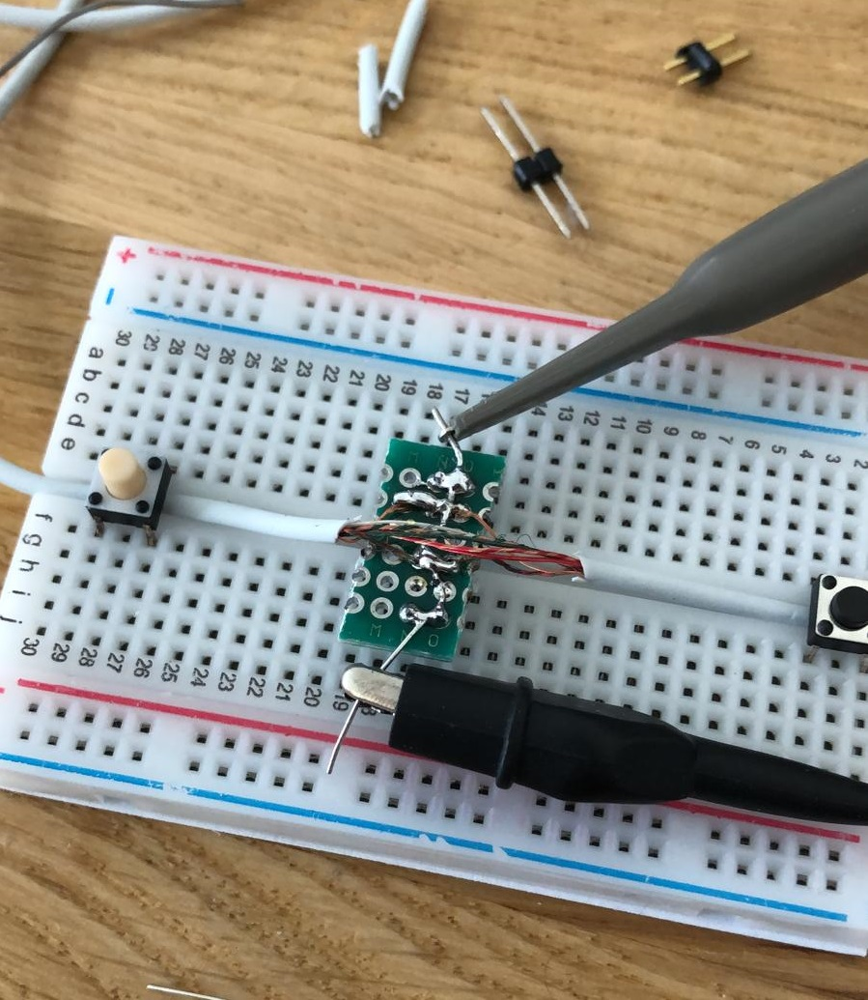

# ESP32 Airpods
Using the Apple supplied earpods as wireless headphones instead. Personally I really like the fit and sound of the stock earpods, though the internal wire connections keep breaking (due to use) close to the connector (due to improper strain relieve). Not keen to spend the big bucks on a set of airpods, I decided to build my own set of 'airpods' around the earpods I already had. 

## Reverse engineering the new button protocol
Searching the internet for articles covering how the inline buttons (volume up, pause, volume down) and microphone communicate with the i-device, only one useful source was found [here] (http://david.carne.ca/shuffle_hax/shuffle_remote.html). An article from 2009 covering the reverse engineering of the 'iPod Shuffle headphones'. In the meantime, the 3.5mm jack was replaced with a lightning connector, also changing the protocol somewhat. 

## Setup
First, we need to Splicing the cable of a working set of earpods with lightning connector to measure the signals coming from the iPhone / headphones. This is quite a tricky task, as the buttons should continue to work afterwards, but the attempt was succesful:

### Power-on signaling
In the article, a power-on signalling was discussed, as seen fromn the button side. In this case, the buttons are perfectly operational, but Im looking to simulate the iPhone side of things. Measuring the power-on signalling on the device, we see this behaviour:

### Buttons
The center button, as before, shorts the CTL line to ground:

The plus and minus buttons seemed to have changed. I was not able to review the signal in detail yet. But we get this for +

And this for minus

